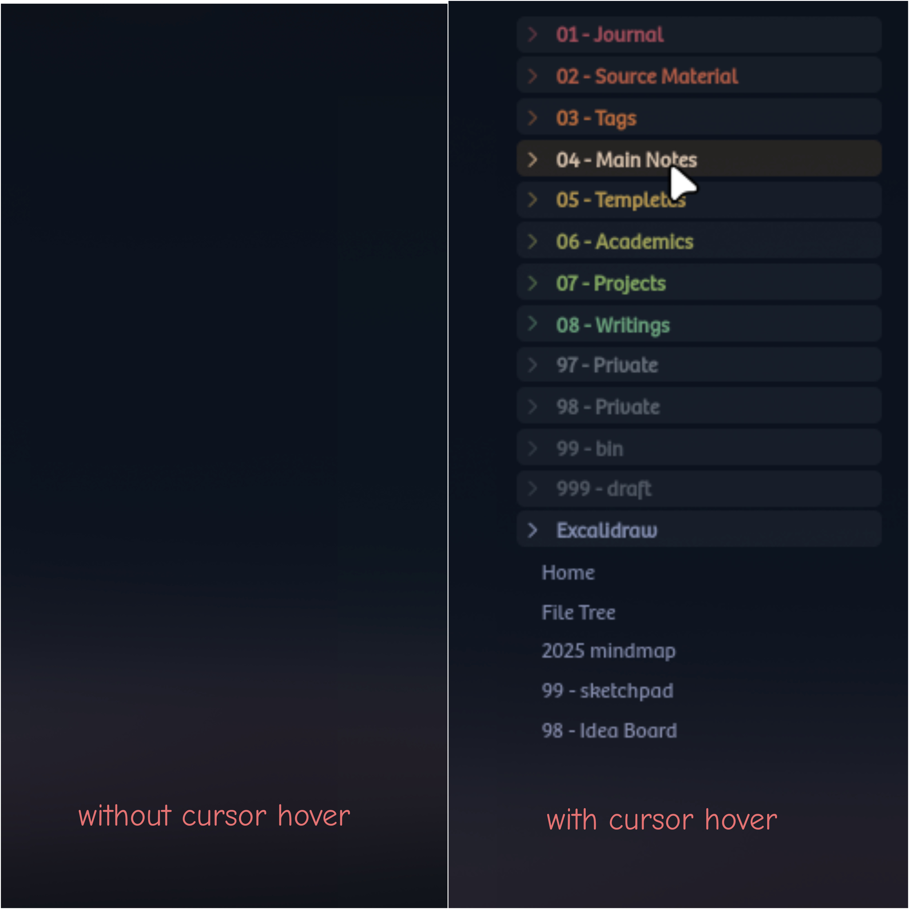
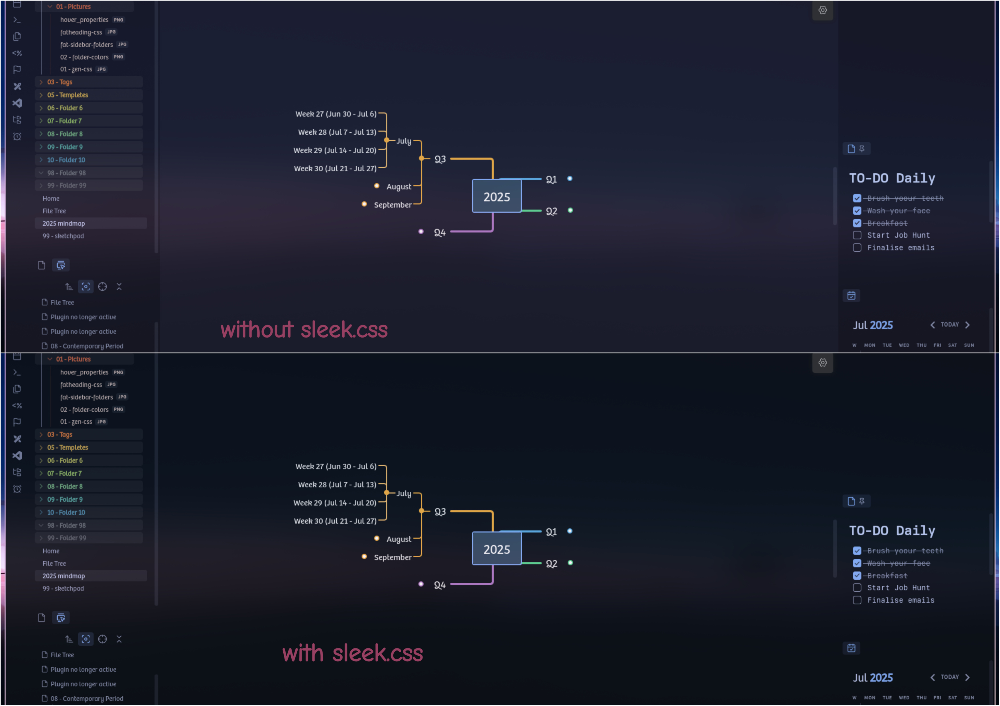
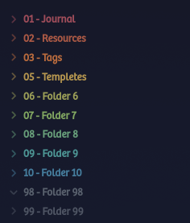
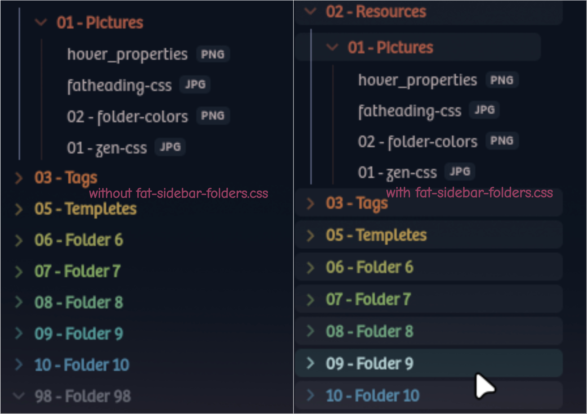
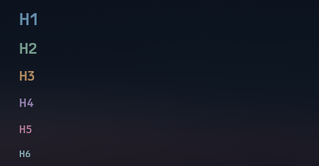
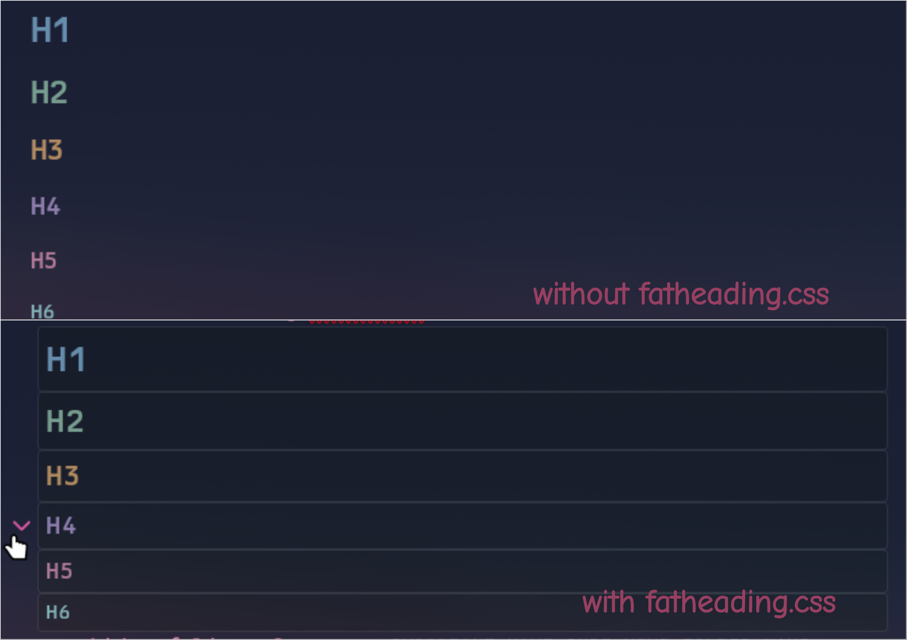
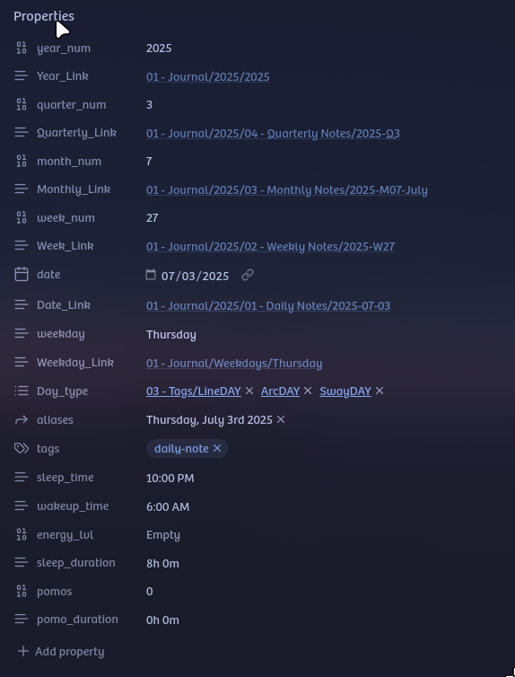

# Obsidian CSS Snippets

A collection of custom CSS snippets for Obsidian, designed to enhance your note-taking experience.

---

- **00 - zen.css**: This snippet will only allow UI elements to appear on hover, that is when you put cursor on them.

- **01 - sleek.css**: It standardizes all background colors for a sleek, unibody design.

- **02 - sidebar-folder-colors.css**:
==IMPORTANT!! MAKE SURE YOUR FOLDER NAME STARTS WITH PROPER PREFIX i.e. 01,02 and so on==
I have included colors for folder prefixes 00 - 15 and then from 93 - 99 if you want to add more feel free to edit with any AI or change values with vs code.

- **03 - fat-sidebar-folders.css**: It's sidebar-folder-colors with a box around folders.

- **04 - custom-heading-colors.css**: This changes the heading colors.

- **05 - fatheading.css**: It creates a box around your headings

- **06 - text-formatting.css**: This basically changes these styles:
**BOLD** *Italic* ==Highlight== and ~~Strikethrough~~

- **07 - hover-properties.css**: It makes the note-taking experience cleaner by only showing properties when you hover over them rest of the time they remain collapsed.

---

## How to Use

1.  **Download the snippets:** You can clone this repository or download individual `.css` files.
2.  **Place in Obsidian:** Copy the `.css` files into your Obsidian vault's `.obsidian/snippets/` folder. If this folder doesn't exist, create it.
3.  **Enable in Obsidian:** Open Obsidian, go to `Settings` -> `Appearance` -> `CSS snippets`, and toggle on the snippets you wish to use.

## Contributions

Feel free to open an issue or submit a pull request if you have suggestions or improvements!